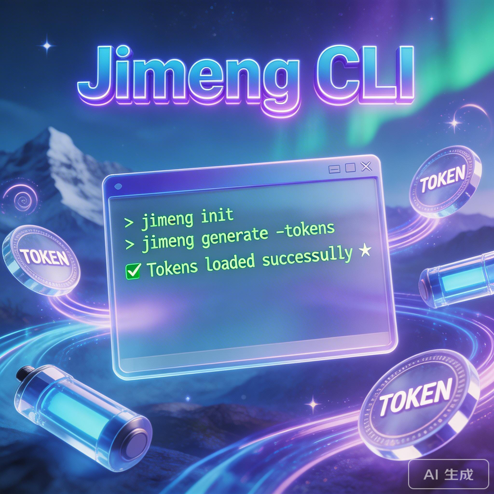

# 已经有了 Dreamina CLI，为什么我依然推荐你用 Jimeng CLI？

最近看到不少 AI 绘画和视频生成的玩家在折腾各种命令行工具，其中名气比较大的可能要数 Dreamina CLI 了。但今天我想给大家安利另一个“宝藏”级的新工具——**Jimeng CLI**。

很多人可能会问：**既然都有了 Dreamina CLI，我为什么还要再装一个功能看似类似的 Jimeng CLI？**

别急，看完这篇文章，你会发现 Jimeng CLI 在“省心”和“极致利用账号”这两个硬核需求上，到底有多好用。

---

## Jimeng CLI 到底是什么？

简单来说，**Jimeng CLI** 也是一个用来在终端（命令行）里快速调用【即梦（Jimeng）】和【Dreamina（剪映国际版的 AI 功能）】生成图片和视频的工具。

它的最大魅力用一句话总结就是：**普通账号免费用，无需花钱开 VIP，无需面对满屏不懂的代码。**

## 为什么有了 Dreamina CLI 还要用它？

如果你用过早期的各种大模型命令行工具，你可能会遇到这几个痛点：账号动不动就欠费、遇到国内版和国际版无法兼顾、每次生成都要小心翼翼算余额。在这几个点上，Jimeng CLI 可以说是一次“降维打击”：

### 1. 独家绝活：全自动的“Token 电池”系统（Token 池）
这是 Jimeng CLI 最杀手级的功能。平时我们要么面对免费额度用完的尴尬，要么得手动一个个切换账号。
Jimeng CLI 内置了一个**自动 Token 池系统**（把它想象成一个充电宝盒子）：
- 你可以把手里多个普通的免费账号一股脑儿塞进池子里。
- 它支持**一键批量查询所有账号的积分余额**以及**批量自动领取每日免费积分**。
- **自动轮换出图**：生成图片和视频时，它会自动从池子里找一张“有余额、能用”的号来跑。一旦某个号偶尔失败或掉线，它会自动切换下一个。这就意味着，只要你的免费号够多，你几乎拥有了极长的满额生产力。

### 2. “海纳百川”：五大区域无缝统管
Dreamina CLI 通常偏向于使用海外版的网络环境和端点。而 Jimeng CLI 更加兼容并包：
- 它不仅支持国际区（美国 US、香港 HK、日本 JP、新加坡 SG），**还原生完美支持「中国大陆（CN）区的即梦」**！
- 所有的调用都会自动路由。你可以随时用 `cn` 区跑即梦最新的 `jimeng-5.0` 图像模型，下一秒又切到 `jp` 区用国际版跑 `veo3` 或 `sora2` 的视频模型，不需要搞复杂的部署。

### 3. 一切都更傻瓜化
写代码不是为了让生活变复杂。Jimeng CLI 提供了一套极其通俗的交互界面，什么积分领取、Token 自动失效管理通通自动化。

---

## 几招上手，小白也能快速开玩

不用怕黑框框，Jimeng CLI 的命令可以说是“说人话”的级别。

**首先，安装它（需要你的电脑装了 Node.js）：**
```bash
npm install -g jimeng-cli
```

**第一步：傻瓜式登录**
```bash
jimeng login
```
*（跟着提示走，它会自动帮你把账号的凭证拿到并放进前面提到的“Token 池”里，默认就是国内的即梦区。）*

**第二步：念咒生图**
```bash
jimeng image generate --prompt "一只赛博朋克风格的机器猫，走在霓虹灯闪烁的雨夜街道"
```
回车一敲，它就会自动去跑图，然后把图片直接下到你面前。

**第三步：一键生成唯美视频**
```bash
jimeng video generate --prompt "绝美海滨日落，海浪轻轻拍打礁石，电影感，慢镜头" --wait
```
加上 `--wait`，你只需要等几分钟，一个电影级的短视频就送到你的电脑上了。

**第四步：一键查看自己的“资产”**
```bash
jimeng token pool
```
输入这个，你的所有账号、对应在哪个区（CN或者US）、还有多少剩余积分，一目了然！

---

## 总结

如果你只是偶尔体验一下 AI，用网页版确实够了。但如果你是一个经常需要**批量生图、测试提示词（Prompt）**，或者想把**多个普通账号的免费每日额度统合起来榨干用尽**的重度玩家、创作者，既想要兼顾国内优秀的最新模型，又想玩转国际版视频模型，那么 Jimeng CLI 绝对是目前最懂你的自动驾驶舱。

装上它，把你的账号塞进去，一起来感受命令行的魅力吧！
